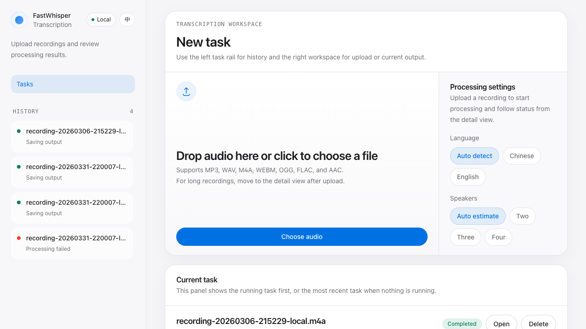
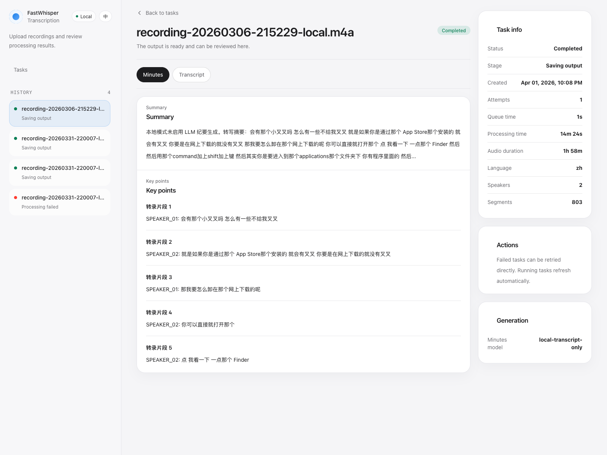

# FastWhisper

[简体中文](README.zh.md)

FastWhisper is a local-first workspace for turning recordings into transcripts and optional meeting minutes. It ships with audio upload, task history, current-task inspection, retry/delete actions, and optional speaker diarization or LLM-powered minutes.

## Screenshots

### Home



### Task detail



## What It Is

- Local-first by default: `SQLite + inline task execution`
- You can run the main workflow without PostgreSQL or Redis
- The default experience focuses on transcription and task review
- Speaker diarization and meeting minutes are optional enhancements

## Current Capabilities

- Audio upload and task creation
- faster-whisper transcription
- Task history, detail view, retry, and delete
- Optional speaker diarization
  - Uses `pyannote` when full dependencies and a Hugging Face token are available
  - Falls back to local clustering when the pipeline is unavailable
- Optional structured meeting minutes
  - Disabled by default
  - Enabled when LLM settings are configured

## Tech Stack

### Backend

- Python 3.11
- FastAPI
- SQLAlchemy
- SQLite by default
- Optional PostgreSQL + separate worker mode
- faster-whisper
- Optional pyannote.audio

### Frontend

- Vue 3
- Vite
- Pinia
- Vue Router
- Tailwind CSS

## Runtime Modes

### 1. Default Local Mode

Recommended for getting started quickly.

- Database: SQLite
- Task execution: inline inside the API process
- Dependency file: `requirements-local.txt`
- LLM minutes disabled by default

### 2. Full Worker Mode

Recommended when you want a separate worker process or a PostgreSQL-backed setup.

- Database: PostgreSQL
- Task execution: API + dedicated worker
- Dependency file: `requirements.txt`
- Works with Docker Compose

Notes:

- The current codebase does not require a standalone message queue for the main workflow.
- `docker-compose.yml` still includes PostgreSQL / Redis services for full deployments and compatibility.

## Quick Start

### Requirements

- Python `3.11`
- Node.js `18+`
- npm

The repo pins Python 3.11 via [`.python-version`](.python-version) and [`pyproject.toml`](pyproject.toml).

### Recommended Local Setup

1. Copy backend config

```bash
cp .env.example .env
```

2. Create frontend config

```bash
cat > frontend/.env <<'EOF'
VITE_API_TOKEN=your_secure_token_here
EOF
```

3. Start everything

```bash
./dev.sh all
```

Default addresses:

- Frontend: `http://localhost:3000`
- Backend: `http://localhost:8000`
- API docs: `http://localhost:8000/docs`

If your backend is running on a different port, override the Vite proxy target:

```bash
VITE_DEV_API_TARGET=http://localhost:18000 ./dev.sh frontend
```

## Common Commands

```bash
# Start backend (automatically chooses local or full mode)
./dev.sh backend

# Start frontend only
./dev.sh frontend

# Start everything
./dev.sh all

# Start dedicated worker (full mode only)
./dev.sh worker

# Stop services
./dev.sh stop

# Show service status
./dev.sh status
```

## Manual Startup

### Local Mode

```bash
pip install -r requirements-local.txt
cp .env.example .env
mkdir -p storage/uploads storage/results
uvicorn app.main:app --host 0.0.0.0 --port 8000 --reload
```

No separate worker is needed in local mode.

### Full Mode

```bash
pip install -r requirements.txt
cp .env.example .env
mkdir -p storage/uploads storage/results
alembic upgrade head
uvicorn app.main:app --host 0.0.0.0 --port 8000 --reload
python -m app.worker
```

### Docker Compose

```bash
cp .env.example .env
docker compose up -d
docker compose logs -f
```

## Configuration

Main backend settings live in `.env`:

```bash
# Default local database
DATABASE_URL=sqlite+aiosqlite:///./storage/fastwhisper.db

# API auth
API_TOKEN=your_secure_token_here

# Whisper
WHISPER_MODEL=large-v3
WHISPER_DEVICE=cuda
WHISPER_COMPUTE_TYPE=float16

# Runtime mode
TASK_RUNNER=inline

# Optional enhancements
ENABLE_SPEAKER_DIARIZATION=true
ENABLE_LLM_MINUTES=false
HUGGINGFACE_TOKEN=your_huggingface_token
LLM_API_KEY=your_llm_api_key
LLM_MODEL=qwen-max
LLM_BASE_URL=https://dashscope.aliyuncs.com/compatible-mode/v1
```

Main frontend setting in `frontend/.env`:

```bash
VITE_API_TOKEN=your_secure_token_here
```

During development, `/api` and `/health` are proxied to `http://localhost:8000` by default.  
Use `VITE_DEV_API_TARGET` if your backend runs elsewhere.

## Suggested Local Defaults

If you only want the core flow working first:

```bash
WHISPER_MODEL=small
WHISPER_DEVICE=cpu
TASK_RUNNER=inline
ENABLE_LLM_MINUTES=false
```

If you want better diarization:

- install full dependencies from `requirements.txt`
- set `HUGGINGFACE_TOKEN`
- keep `ENABLE_SPEAKER_DIARIZATION=true`

If you want meeting minutes:

- set `LLM_API_KEY`
- set `ENABLE_LLM_MINUTES=true`

## API Overview

| Method | Path | Description |
| --- | --- | --- |
| `POST` | `/api/v1/tasks` | Upload audio and create a task |
| `GET` | `/api/v1/tasks` | List tasks |
| `GET` | `/api/v1/tasks/{task_id}` | Get task details |
| `GET` | `/api/v1/tasks/{task_id}/progress` | Get task progress |
| `GET` | `/api/v1/tasks/{task_id}/minutes` | Get minutes and transcript |
| `POST` | `/api/v1/tasks/{task_id}/retry` | Retry a failed task |
| `DELETE` | `/api/v1/tasks/{task_id}` | Delete a task |
| `GET` | `/api/v1/tasks/stats/overview` | Get task statistics |
| `GET` | `/health` | Health check |

## Testing

```bash
# Backend tests
pip install -r requirements-test.txt
pytest -q

# Frontend build
cd frontend && npm run build
```

## Frontend Layout

- Left rail: task history
- Right workspace: upload and current task
- Built-in Chinese / English UI switch

## Project Structure

```text
fastwhisper/
├── app/                  # FastAPI app and services
├── alembic/              # Database migrations
├── frontend/             # Vue frontend
├── docs/screenshots/     # README screenshots
├── storage/              # Uploads and generated output
├── requirements-local.txt
├── requirements.txt
├── requirements-test.txt
├── dev.sh
├── docker-compose.yml
├── README.md
└── README.zh.md
```

## License

MIT
