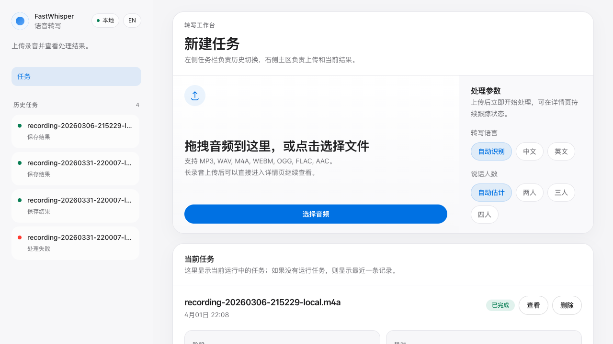
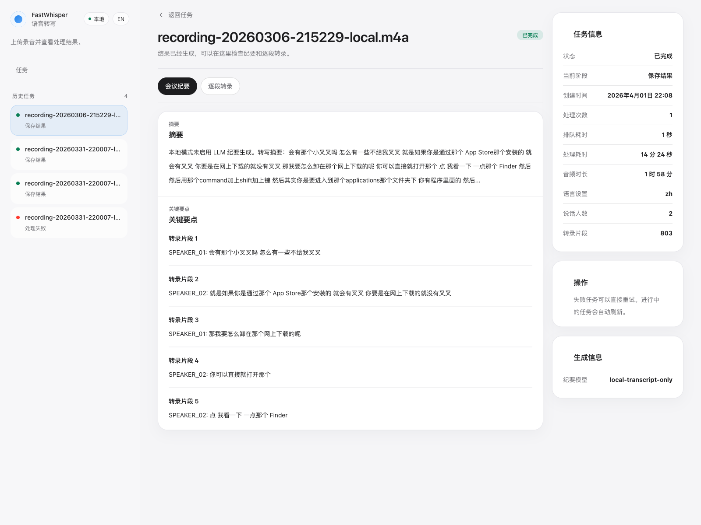

# FastWhisper

[English](README.md)

FastWhisper 是一个从录音到转写结果的本地优先工作台。它提供音频上传、任务历史、当前任务查看、任务重试，以及可选的说话人分离和会议纪要生成能力。

## 界面预览

### 首页



### 任务详情



## 项目定位

- 默认模式是本地优先: `SQLite + API 内联任务处理`
- 不需要先配 PostgreSQL 或 Redis 才能跑通主流程
- 默认重点是语音转写和任务回看
- 说话人分离和 LLM 纪要属于可选增强能力

## 当前能力

- 音频上传与任务创建
- faster-whisper 转写
- 任务列表、任务详情、失败重试、删除任务
- 可选说话人分离
  - 有 Hugging Face Token 和完整依赖时优先用 `pyannote`
  - 不可用时回退到本地聚类分人
- 可选会议纪要生成
  - 默认关闭
  - 配置 LLM 后可生成结构化纪要

## 技术栈

### 后端

- Python 3.11
- FastAPI
- SQLAlchemy
- SQLite 默认本地存储
- 可选 PostgreSQL + 独立 Worker 模式
- faster-whisper
- 可选 pyannote.audio

### 前端

- Vue 3
- Vite
- Pinia
- Vue Router
- Tailwind CSS

## 运行模式

### 1. 默认本地模式

适合快速体验和日常本地使用。

- 数据库: SQLite
- 任务执行: API 进程内联执行
- 依赖文件: `requirements-local.txt`
- 默认不启用 LLM 纪要

### 2. 完整 Worker 模式

适合需要独立 Worker 或切回 PostgreSQL 的场景。

- 数据库: PostgreSQL
- 任务执行: API + 独立 Worker
- 依赖文件: `requirements.txt`
- 可搭配 Docker Compose

说明:
- 当前代码已经不依赖单独消息队列才能完成主流程。
- `docker-compose.yml` 仍保留 PostgreSQL / Redis 服务，主要用于兼容完整部署场景。

## 快速开始

### 环境要求

- Python `3.11`
- Node.js `18+`
- npm

仓库通过 [`.python-version`](.python-version) 和 [`pyproject.toml`](pyproject.toml) 固定到了 Python 3.11。

### 本地推荐启动方式

1. 复制后端配置

```bash
cp .env.example .env
```

2. 创建前端配置

```bash
cat > frontend/.env <<'EOF'
VITE_API_TOKEN=your_secure_token_here
EOF
```

3. 启动全部服务

```bash
./dev.sh all
```

默认地址:

- 前端: `http://localhost:3000`
- 后端: `http://localhost:8000`
- 文档: `http://localhost:8000/docs`

如果你的后端不是跑在 `8000`，启动前端时可以覆盖代理目标:

```bash
VITE_DEV_API_TARGET=http://localhost:18000 ./dev.sh frontend
```

## 常用命令

```bash
# 启动 API（自动选择本地模式或完整模式）
./dev.sh backend

# 仅启动前端
./dev.sh frontend

# 完整启动
./dev.sh all

# 启动独立 Worker（仅完整模式需要）
./dev.sh worker

# 停止服务
./dev.sh stop

# 查看状态
./dev.sh status
```

## 手动启动

### 本地模式

```bash
pip install -r requirements-local.txt
cp .env.example .env
mkdir -p storage/uploads storage/results
uvicorn app.main:app --host 0.0.0.0 --port 8000 --reload
```

本地模式下不需要额外启动 Worker。

### 完整模式

```bash
pip install -r requirements.txt
cp .env.example .env
mkdir -p storage/uploads storage/results
alembic upgrade head
uvicorn app.main:app --host 0.0.0.0 --port 8000 --reload
python -m app.worker
```

### Docker Compose

```bash
cp .env.example .env
docker compose up -d
docker compose logs -f
```

## 配置说明

后端主要配置在 `.env`:

```bash
# 本地默认数据库
DATABASE_URL=sqlite+aiosqlite:///./storage/fastwhisper.db

# API 鉴权
API_TOKEN=your_secure_token_here

# Whisper
WHISPER_MODEL=large-v3
WHISPER_DEVICE=cuda
WHISPER_COMPUTE_TYPE=float16

# 本地/Worker 模式切换
TASK_RUNNER=inline

# 可选增强
ENABLE_SPEAKER_DIARIZATION=true
ENABLE_LLM_MINUTES=false
HUGGINGFACE_TOKEN=your_huggingface_token
LLM_API_KEY=your_llm_api_key
LLM_MODEL=qwen-max
LLM_BASE_URL=https://dashscope.aliyuncs.com/compatible-mode/v1
```

前端主要配置在 `frontend/.env`:

```bash
VITE_API_TOKEN=your_secure_token_here
```

开发代理默认把 `/api` 和 `/health` 转发到 `http://localhost:8000`。  
如需改端口，请使用环境变量 `VITE_DEV_API_TARGET`。

## 默认体验建议

如果你只是想先把流程跑起来，建议从下面这组配置开始:

```bash
WHISPER_MODEL=small
WHISPER_DEVICE=cpu
TASK_RUNNER=inline
ENABLE_LLM_MINUTES=false
```

如果需要更好的说话人分离:

- 安装完整依赖 `requirements.txt`
- 配置 `HUGGINGFACE_TOKEN`
- 保持 `ENABLE_SPEAKER_DIARIZATION=true`

如果需要生成会议纪要:

- 配置 `LLM_API_KEY`
- 设置 `ENABLE_LLM_MINUTES=true`

## API 概览

| Method | Path | Description |
| --- | --- | --- |
| `POST` | `/api/v1/tasks` | 上传音频并创建任务 |
| `GET` | `/api/v1/tasks` | 获取任务列表 |
| `GET` | `/api/v1/tasks/{task_id}` | 获取任务详情 |
| `GET` | `/api/v1/tasks/{task_id}/progress` | 获取任务进度 |
| `GET` | `/api/v1/tasks/{task_id}/minutes` | 获取纪要与转写结果 |
| `POST` | `/api/v1/tasks/{task_id}/retry` | 重试失败任务 |
| `DELETE` | `/api/v1/tasks/{task_id}` | 删除任务 |
| `GET` | `/api/v1/tasks/stats/overview` | 获取统计信息 |
| `GET` | `/health` | 健康检查 |

## 测试与校验

```bash
# 后端测试
pip install -r requirements-test.txt
pytest -q

# 前端构建
cd frontend && npm run build
```

## 前端界面

- 左侧是任务历史栏
- 右侧主区只保留上传和当前任务
- 中英文界面可以直接切换

## 目录结构

```text
fastwhisper/
├── app/                  # FastAPI 应用与服务层
├── alembic/              # 数据库迁移
├── frontend/             # Vue 前端
├── docs/screenshots/     # README 截图
├── storage/              # 上传文件与结果
├── requirements-local.txt
├── requirements.txt
├── requirements-test.txt
├── dev.sh
├── docker-compose.yml
├── README.md
└── README.zh.md
```

## 许可证

MIT
